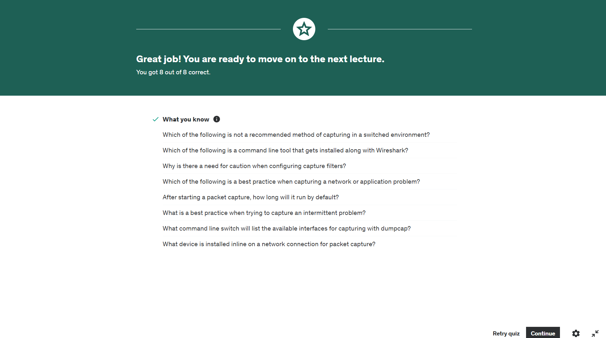
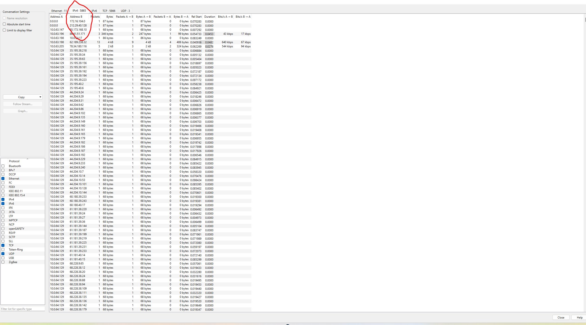

# ROAD TO WIRESHARK


## Introduction

Welcome to the "Road to Wireshark" repository! This repository will document my learning journey as I dive deep into Wireshark, guided by the Udemy course **[Getting Started with Wireshark: The Ultimate Hands-On Course](https://www.udemy.com/course/wireshark-ultimate-hands-on-course/?couponCode=KEEPLEARNING)** by Chris Greer. This course is designed to make the intimidating world of packet analysis approachable and actionable, helping IT engineers and cybersecurity professionals enhance their network troubleshooting and analysis skills.
This repo is dedicated to documenting my journey in learning Wireshark, a powerful network protocol analyzer. Below you'll find an outline of the topics I'll be covering, along with some initial resources and notes.

## Course Overview

### Course Title:
**Getting Started with Wireshark: The Ultimate Hands-On Course**

### Instructor:
Chris Greer, Wireshark University instructor and packet analysis consultant.

### Duration:
7 hours

### Description:
Wireshark can be overwhelming with the vast amount of data it captures. This course aims to demystify the tool, showing you practical ways to use Wireshark to solve network issues and isolate cybersecurity incidents. Real-world examples, assignments, and hands-on exercises will help you become comfortable with the interface, understand core protocols, and develop the skills to interpret packets and find actionable data quickly.

### What You’ll Learn:
- Capture and interpret network traffic with Wireshark
- Understand core networking protocols: DHCP, DNS, TCP/IP
- Troubleshoot the top five network problems with Wireshark
- Analyze cybersecurity attacks with Wireshark

### Prerequisites:
- Basic understanding of networking (switching, routing)

### Target Audience:
- Network Engineers and Cybersecurity professionals
- Threat hunters looking to delve into protocol analysis

## Goals and Objectives

Through this course, my primary objectives are to:
1. **Gain Proficiency in Wireshark:** Learn to navigate the Wireshark interface, customize it, and utilize its features effectively.
2. **Understand Network Protocols:** Develop a solid understanding of core networking protocols and how to analyze them using Wireshark.
3. **Troubleshoot Network Issues:** Acquire the skills to identify and troubleshoot common network problems.
4. **Analyze Cybersecurity Incidents:** Learn to capture and interpret traffic related to cybersecurity attacks.

## Learning Roadmap

This section will be updated as I progress through the course, documenting my notes and key learnings from each module. The roadmap will be structured according to the course curriculum and include:

1. **Introduction to Wireshark**
   - Installation and initial setup
   - Overview of the Wireshark interface
2. **Capturing Traffic**
   - Selecting interfaces
   - Starting and stopping captures
3. **Display and Capture Filters**
   - Basic and advanced filter usage
4. **Analyzing Packets**
   - Packet details and bytes pane
   - Common protocols and their analysis
5. **Real-World Examples**
   - Troubleshooting network issues
   - Analyzing security incidents


## What is Wireshark?

Wireshark is an open-source packet analyzer used for network troubleshooting, analysis, software and protocol development, and education. It captures and interactively browses the traffic running on a computer network.

### Key Features:
- Live capture and offline analysis
- Deep inspection of hundreds of protocols
- Standard three-pane packet browser**
- Multi-platform support (Windows, macOS, and UNIX)
- Rich VoIP analysis
- Read/write many different capture file formats
- Powerful display filters
- Decryption support for many protocols

## Section Five (5): Where and How to Capture Packets

#### Think BEFORE You Capture!

In the module "Think Before You Capture," I learned the importance of planning before diving into packet analysis with Wireshark. First, identify who is affected by the issue, whether it's isolated or widespread, and whether it's consistent or intermittent. Determine which applications and servers are impacted and if they are local or cloud-based. Understanding the network path the traffic traverses is essential for a clean capture. By considering these factors beforehand, I can capture data more effectively and resolve issues faster.

 #### How To Capture In a Switched Environment - Local Capture vs SPAN vs TAP

In this module, I learned the following key points about capturing traffic in a switched environment:

1. **Local Capture:** Installing Wireshark directly on an endpoint can be quick and easy but may strain the device's resources, especially on busy servers.
2. **SPAN/Mirror:** This method involves configuring network devices to forward packets to a monitor port. It's crucial to avoid overloading the SPAN port by sending too much traffic.
3. **Network TAP:** A TAP is a physical device inserted into the network path, providing a reliable way to capture traffic without burdening the network devices or endpoints.

Understanding these methods helps ensure effective packet capturing in switched environments.

### Capturing at Multiple Locations

When troubleshooting network issues, especially performance problems, it's beneficial to capture traffic from multiple network points. Here are the key points I learned:

1. **Client-Side Capture:** Capturing packets from the client can reveal local network conditions, broadcast activity, and the client's interactions with multiple servers.
2. **Server-Side Capture:** Capturing packets from the server can show interactions with other backend services, such as application or database servers, which might be causing the slowdown.
3. **Dual-Side Capture:** Capturing from both client and server sides helps in identifying issues like retransmissions and packet loss, offering a clearer picture of where the problem lies.

This multi-point capture approach provides a comprehensive view of the network issue, making troubleshooting more effective.

### Using Capture Filter?

- **Capture Filter**: Allows you to collect only specific traffic based on criteria you set (e.g., TCP packets, traffic to/from a specific IP address).

- **When to Use**:
  - If you know exactly what you need and want to limit the amount of captured data.
  - Useful in busy environments to focus on relevant traffic.

- **When to Avoid**:
  - If you are unsure of the issue or need to see all network activity, as capture filters might miss important traffic (e.g., backend server conversations).
  - Specific filters might exclude useful information from other protocols (e.g., ICMP messages for troubleshooting TCP issues).

- **Best Practice**:
  - Capture all traffic initially and then use display filters to analyze data. This approach provides a more comprehensive view and aids in thorough troubleshooting.
  
 ### Capturing traffic with Wireshark : User Interface

When I start Wireshark, it shows all the available interfaces, including Ethernet and Wi-Fi. To begin capturing, I select the relevant interface and click the blue shark fin icon. To stop the capture, I click the red square icon.


I learned to enable promiscuous mode in the capture options, which allows me to capture all traffic on the network, not just my own. I also discovered the snap length setting, which lets me capture only the headers (e.g., 64 bytes) to save space and avoid capturing sensitive payloads.

**Capturing Packets** 

---

https://github.com/user-attachments/assets/9afcfb8e-9be0-478d-9b32-d6ba09ac67ee

 ##### Packet Capture in motion
Customizing the interface list to show only the ones I use regularly is another valuable lesson. I can manage these interfaces in the capture options by unchecking those I don't need. After configuring these settings, I can start capturing traffic by clicking "Start."


#### Long-Term Capture Configuration with Wireshark

Setting up long-term capture in Wireshark is essential for troubleshooting intermittent issues and monitoring for cybersecurity threats. By using the capture options in the Wireshark interface, I can start capturing traffic on a selected interface and configure it to save the data to a permanent file. Instead of capturing one massive file, I learned to use a **ring buffer,** which captures several smaller files and overwrites the oldest files when the buffer is full. 

This setup helps manage disk space efficiently and makes it easier to pinpoint when an issue occurred. I also discovered that enabling promiscuous mode allows capturing all network traffic, not just traffic to and from my machine. Additionally, using the **pcapng** format over pcap provides more metadata, which is helpful for analysis. With these configurations, I can ensure continuous monitoring and have historical data available for when problems arise or if a security incident occurs. 

https://github.com/user-attachments/assets/9e9be351-a140-443f-bd93-fba261e203ec

## How to Capture on the Command Line with Dumpcap

As I continue my studies in Wireshark, I've learned how to capture packets using Dumpcap directly from the command line. This method is particularly useful when working on busy servers or when I want a quick capture without using the full Wireshark GUI.

### Accessing Dumpcap

Dumpcap is included with Wireshark and is located in the Wireshark installation directory. To simplify access, I added the Wireshark installation directory to my system's PATH variable.

### Adding Wireshark to PATH on Windows

To add Wireshark to the PATH on Windows:

1. Open Control Panel and go to System > Advanced system settings.
2. In the Environment Variables section, find and edit the Path variable to include the Wireshark installation directory, typically `C:\Program Files\Wireshark`.


### Using Dumpcap

First, I opened the command prompt. To list all available network interfaces, I used:

```sh
dumpcap -D

```
This command displays all the interfaces I can capture from.


To start capturing on a specific interface, I used:

```sh
dumpcap -i [interface_number] -w [output_file]
```
For example, to capture on interface 4, which is my Wifi Interface as seen in the above image and write the output to test.pcapng, I used:
```sh
dumpcap -i 4 -w test.pcapng
```
To stop the capture, I simply pressed Ctrl + C.

Watch the video below to appreciate the whole process

https://github.com/user-attachments/assets/7571b97f-07e8-47de-86ec-b2fdad070da8

!!!!Note Learning to use Dumpcap for command-line captures has been incredibly valuable, especially for quick, efficient captures in my cybersecurity work.


----
### Configuring a Ring-Buffer on the CLI

When you want to capture traffic over an extended period using `dumpcap`, setting up a ring buffer on the command line is a game-changer. Here’s how you can do it:

If you ever get stuck or forget how to use `dumpcap`, just type:

```bash
dumpcap -h
```

This will show you all the options you can use. But here’s a straightforward way to set up your ring buffer:

```sh
dumpcap -i 4 -w noble.pcapng -b files:10 -b filesize:100
dumpcap -i 4 -w C:\Users\noble\Desktop\PROJECTS\road-to-wireshark\pcaps\RingBuffer\noble.pcapng -b files:10 -b filesize:100
```

- `-i 4` specifies the network interface you want to use. You may need to replace `4` with the correct interface number for your setup.
- `-w noble.pcapng` names your capture file. You can choose any filename you like, not just "noble". NB: The directotry to the file is the `"C:\Users\noble\Desktop\PROJECTS\road-to-wireshark\pcaps\RingBuffer\"`
- `-b files:10` sets the number of files in your ring buffer to 10. This means you will have a rotating set of 10 files.
- `-b filesize:500` sets the size of each file to 500 KB . If you need larger or smaller files, adjust this number accordingly.

https://github.com/user-attachments/assets/00a68853-27e5-47ec-94e1-10539251bff2

*Video Illustration Above*
What’s great about this setup is that dumpcap will continuously capture traffic, rotating through the files. Once it reaches the maximum number of files (10 in this case), it will start overwriting the oldest files.

This approach is particularly useful if you're capturing traffic in a busy environment or on a server. It ensures you don't run out of disk space and keeps your capture going without needing manual intervention.

---

Section Fice (5) Quiz Result



---

## SECTION SIX (6) : THE ANATOMY OF A PACKET -  HOW ENCAPSULATION WORKS

### Packets and the OSI Model

Understanding the anatomy of a packet starts with the OSI model. Think of it as a guide to how different protocols interact and how various network devices fit into the communication process.

The OSI model is a seven-layer framework used to describe network protocols and interactions:

- **Application Layer**: Where applications and end-user services operate.
- **Presentation Layer**: Responsible for data translation and encryption.
- **Session Layer**: Manages sessions and connections between applications.
- **Transport Layer**: Handles end-to-end communication and error recovery.
- **Network Layer**: Manages packet forwarding including routing through different networks.
- **Data Link Layer**: Responsible for node-to-node data transfer and error detection.
- **Physical Layer**: Deals with the physical connection between devices, such as cables and hardware interfaces.
  
  
Source: [What Are the 7 Layers of the OSI Model?](https://sparkbox.com/foundry/what_are_the_7_layers_of_the_OSI_model_network_of_communication)

In practice, you might hear about network devices operating at specific layers, such as routers (network layer) and switches (data link layer). The OSI model helps in understanding where these devices and protocols function.

Another commonly used model is the TCP/IP model, which simplifies the OSI model into four layers:

- **Network Interface Layer**: Combines the OSI’s Physical and Data Link layers.
- **Internet Layer**: Maps to the OSI’s Network layer.
- **Transport Layer**: Corresponds to the OSI’s Transport layer.
- **Application Layer**: Covers the OSI’s Application, Presentation, and Session layers.
  

Source: [TCP/IP Model](https://www.linkedin.com/pulse/tcpip-model-arshad-ali/)

Click [here](https://www.youtube.com/watch?v=i9RL5jD9cTI) to view the comparism of the two types of models


Protocols operate at different layers of these models. For instance, HTTP and FTP are application-layer protocols, while TCP and UDP are transport-layer protocols. Understanding which layer a protocol operates on is crucial for effective network analysis and troubleshooting.

The key takeaway is that these models help in structuring how data is transmitted and received across networks. By understanding and using these models, you can better grasp how different protocols and devices interact and how to troubleshoot issues effectively.

###  Ethernet - The Frame Header

Ethernet operates at the **data link layer** (layer two) of the OSI model. In Wireshark, data is captured by the packet driver before being analyzed. The structure of the Ethernet frame is crucial for understanding how data is transmitted across a network.

The Ethernet frame header consists of several key components:

**Destination MAC Address (6 bytes)**: Specifies the intended recipient at layer two.

**Source MAC Address (6 bytes)**: Identifies the sender.

**EtherType Field (2 bytes)**: Indicates the protocol encapsulated in the payload.


Source: [The Ethernet II Frame Format](https://www.firewall.cx/networking/ethernet/ethernet-ii.html)


The EtherType values have specific meanings:

- `0x0800`: Indicates that the payload contains an IPv4 packet.
- `0x0806`: Indicates an ARP (Address Resolution Protocol) packet.
- `0x86DD`: Indicates an IPv6 packet.

To explore this in Wireshark, you can open a capture file and look at the Ethernet frames. For example, the destination and source MAC addresses are displayed in hexadecimal format. The **EtherType** field tells you the protocol that follows Ethernet. Wireshark may not show the Frame Check Sequence (FCS) because the network interface card (NIC) often does not pass it to Wireshark. The FCS is a 4-byte checksum at the end of the frame, used for error-checking.


To filter for non-IP traffic in Wireshark, use the filter `!(eth.type == 0x0800)`. This will show frames with other EtherType values, such as `0x86DD` for IPv6 or `0x0806` for ARP.

When analyzing Ethernet frames:

- **Frame**: Data at the Ethernet layer.
- **Packet**: Data at the IP layer.
- **Segment**: Data at the TCP layer.

Errors at the frame level, such as FCS errors, indicate transmission issues. These errors are detected by the checksum included in the FCS. If a bit is altered during transmission, it will result in a checksum error, indicating that the frame was corrupted.

### Key Takeaways

- Ethernet frames contain destination and source MAC addresses, an EtherType field, and an optional FCS.
- EtherType values help identify the encapsulated protocol.
- Use Wireshark filters to identify non-IP traffic.
- FCS checksums help detect transmission errors, contributing to reliable data communication.

---

### Unicasts vs Broadcasts vs Multicasts

In my exploration of Ethernet, I delved into the concepts of unicast, broadcast, and multicast communications. Understanding these types is crucial for network packet analysis.

#### Unicast
Unicast communication occurs between a single source and a single destination. Each endpoint has a unique MAC address, and the communication is confined to these two devices. I won't be able to capture this traffic with Wireshark unless using a span, mirror, or tap, because switches only forward unicast packets to the designated interfaces.

#### Broadcast
Broadcast messages are sent to all devices in a network. In Wireshark, I can identify broadcast packets by looking at the destination MAC address, which is all "f's" (`ff:ff:ff:ff:ff:ff`). When a switch receives a broadcast, it sends the packet to all interfaces within the same VLAN. Every device in the VLAN receives the broadcast and decides whether to respond.

#### Multicast
Multicast communication is more selective, targeting multiple specific devices rather than all devices. Multicast packets are sent to a group of devices that are configured to listen for a specific multicast address. This is a "one-to-many" communication model. For instance, IPv6 multicast packets are only processed by devices listening for that specific multicast MAC address.

#### Key Takeaways
- **Unicast**: One-to-one communication, only between two specific devices.
- **Broadcast**: One-to-everyone communication within the same VLAN, using a destination MAC address of all "f's".
- **Multicast**: One-to-many communication, targeting devices configured to listen for a specific multicast address.

Understanding these distinctions helps in analyzing network traffic and diagnosing network issues effectively.


### The Internet Protocol - Learning the Header Values

Moving up the OSI model to the network layer, I delved into the IPv4 header layout and its various fields. This layer primarily involves IPv4 and increasingly, IPv6.

The **IPv4 header** includes the version, header length, differentiated services (Diff Srv), total length, identification number, flags, time to live (TTL), protocol, and source and destination IP addresses.

- **Version**: Indicates IPv4 protocol.
- **Header Length**: Specifies the header size.
- **Differentiated Services (Diff Srv)**: Prioritizes certain traffic types, like VoIP.
- **Total Length**: Includes both header and payload.
- **Identification Number**: Tracks packets through the network, crucial for troubleshooting.
- **Flags**: Manage packet fragmentation.
- **Time to Live (TTL)**: Represents the number of hops a packet can take before being discarded. Each router decrements TTL, aiding in tracing the packet’s path.
- **Protocol**: Specifies the type of payload: TCP (6), UDP (17), or ICMP (1), guiding Wireshark on protocol dissection.
- **Source and Destination IP Addresses**: Ensure packets reach correct endpoints, remaining unchanged unless altered by NAT, PAT, or proxies.

Understanding these fields is essential for network troubleshooting and maintaining smooth communication across the network.


###  Following a Packet Through the Network - Re-Encapsulation


Understanding IP as an end-to-end protocol versus Ethernet as a point-to-point protocol is key. Capturing at different network points shows how headers change. Here’s a simplified scenario to illustrate:

Imagine a PC with IP 10.2 and MAC AA connected to a switch, which connects to a router (IP 10.1, MAC BB), another router (IP 11.1, MAC CC), and finally a server (IP 13.2, MAC FF).

When the PC sends a frame, it includes the source and destination IP (10.2 to 13.2). However, the Ethernet frame’s MAC address targets the gateway first (BB). The router receives it, updates the frame for the next hop (CC to DD), and continues this process.

Throughout the journey, the IP packet remains the same, but the Ethernet frame is re-encapsulated at each hop. This ensures proper delivery across various network segments. If network address translation (NAT) occurs, the IP addresses may change, affecting packet analysis. 

This re-encapsulation process is crucial for understanding how data travels through a network and ensuring successful communication.

### Lab 4: Analyzing a Packet From Multiple Capture Points

In this lab assignment, I explored packet analysis from both the client and server perspectives, highlighting how ethernet and IP headers can appear differently depending on the vantage point. The key focus was on ethernet re-encapsulation.

#### Client-Side Analysis

I examined packet number two and found the following details:
Link to Packet

[Link to Client-Side  Packet](https://github.com/noble-antwi/road-to-wireshark/blob/main/pcaps/Module6_Assignment/udemy-client-slowfiledownload.pcapng)

- **Destination MAC Address:** `00:00:0c:0c:00:0e`
- **Source MAC Address:** `00:0c:29:65:3b:25`
- **IP Identification Number:** `0x7e73` (Hexadecimal), which corresponds to `32771` in decimal.
- **IP Time To Live (TTL):** `128`
- **Source IP Address:** `192.168.1.10`

#### Server-Side Analysis

[Link to Server Sude Packet](https://github.com/noble-antwi/road-to-wireshark/blob/420a9a9949f8f3ebf0708786a5e46f34973738e4/pcaps/Module6_Assignment/udemy-server-slowfiledownload.pcapng)

Switching to the server-side capture, specifically in `udemy-server-slowfiledownload.pcapng`, I identified:

- **Corresponding Packet:** Frame Number `11`, matched using the filter `ip.id == 0x7e73`.
- **Source MAC Address:** `00:00:0c:0c:00:ff`
- **Destination MAC Address:** `00:06:5b:00:02:ff`
- **IP ID:** `32371` (Decimal, equivalent to `0x7e73` in hexadecimal)
- **IP TTL:** `127`

From this analysis, it was observed that the packet passed through **one router** and there was **no NAT (Network Address Translation)** along the path.


This exercise reinforced my understanding of how packets are encapsulated and how the same packet can be viewed differently from various points in the network.

#### Practical Insights

The continuity of the IP ID indicates no NAT or other devices that might alter the IP packet significantly. By using filters based on the IP ID, I can effectively trace the same packet across multiple captures. 

For side-by-side analysis, I learned a useful trick: On Windows, you can open two instances of Wireshark to compare captures easily. On macOS, use the terminal command:

```bash
open -n /Applications/Wireshark.app
```

### Section Review

In this module, I gained a foundational understanding of network protocols and their interactions, focusing on the following areas:

**OSI and TCP Models:** We explored how these models structure network communication, ensuring that protocols operate within their designated layers without interfering with each other. For example, TCP and UDP can both function over IP without overlapping responsibilities.

**Ethernet Frames:** I learned about the components of an Ethernet frame, including various header values and their significance. This understanding is crucial for interpreting how data is encapsulated for transmission.

**IP Protocol:** We examined IP header values and their roles. This foundational knowledge is essential for analyzing IP traffic and will be built upon in further studies of the IP protocol.

**Ethernet Re-Encapsulation:** The module explained how routers handle Ethernet frames. Routers strip off the existing Ethernet frame, re-encapsulate the IP packet into a new Ethernet frame, and forward it to the next destination. This process illustrates the dynamic nature of packet forwarding across networks.

This recap solidifies my grasp of how network protocols are structured and interact. With these basics established, I am prepared to delve deeper into IP protocol troubleshooting and analysis in upcoming modules.

---
---

# Section 7 : Practical IP Analysis

In this module, the focus is on the practical application of IP header values and their analysis. The key objectives include:

**Deep Dive into IP Headers:** The module will enhance my understanding of IP header values by exploring trace files. This hands-on approach will help me become more comfortable with interpreting these values.

**Practical Exercises:** I will analyze real-world trace files to understand the IP header in action. This involves identifying and interpreting various header values to gain insights into network behavior.

**Problem Solving:** I will review a broken example as a consultant, diagnosing and resolving issues based on the IP header information. This exercise is designed to apply theoretical knowledge to practical troubleshooting scenarios.

This module aims to solidify my skills in analyzing IP headers and applying this knowledge to real-world problems, preparing me for more advanced troubleshooting and network analysis tasks.


### Digging Deeper into the IP ID


In this module, I explored the IP identification (IP ID) field in more detail and learned how to utilize it for network troubleshooting. Here's what I took away from this session:

**Analyzing the IP ID:**
I opened the client-side pcap from the previous exercise to focus on the IP ID and observe its behavior. By adding the IP ID as a column in Wireshark, I could easily see the IP ID values for each packet.

**Incrementing IP IDs:**
I noticed that the IP stack on the client side increments the IP ID by one for each packet sent. For example, starting at 371, the IP IDs incremented sequentially: 372, 373, 374, and so on. This pattern helps in tracking packets and understanding the flow of communication.

**Different Directions, Different IP IDs:**
In the opposite direction, the server's packets had a different starting range for IP IDs, such as 609, 610, 611. This difference indicates that IP ID values can vary based on the device and its operating system, which sometimes randomizes the starting point.

**Sequential vs. Random IP IDs:**
If a server is handling multiple conversations, the IP ID values may show significant jumps, indicating the server's busyness. For instance, if the IP ID jumps from 611 to 700 or 800, it suggests that the server is communicating with many other devices. However, not all systems behave this way, as some may randomize IP IDs, making this analysis less straightforward.

**Practical Uses of IP ID:**
I learned that monitoring the IP ID can be useful for tracking packets through a network and estimating how busy a system is. Although not always definitive, the IP ID provides valuable insights when analyzing network traffic and diagnosing issues.

This deeper understanding of the IP ID field enhances my ability to troubleshoot network problems and analyze packet flows more effectively.

### How to Use the TTL Field


[Click to Open Link to the PCAP for the Exercise](https://github.com/noble-antwi/road-to-wireshark/blob/f0f540c392aec6201709ada3c1e1851753081398/pcaps/udemy-ping-fragmentation.pcapng)
In this module, I delved into the practical applications of the Time to Live (TTL) field within Wireshark for network troubleshooting. This field, found in the IP header, holds valuable information about packet travel and can be a powerful diagnostic tool.

**Understanding TTL Values:**
I started by capturing packets using Wireshark and pinging a remote system (www.google.com). The TTL value in the ping response was 54. This TTL value can vary, typically starting at 64, 128, or 255, depending on the operating system and configuration of the device.


**Analyzing TTL for Troubleshooting:**
By examining the TTL value in Wireshark, I observed that it provides insights into the number of hops (routers) a packet traverses. For example, if the initial TTL was 64 and the packet arrived with a TTL of 54, it indicates that the packet passed through 10 routers (64 - 54 = 10). This helps me gauge the distance between the source and destination in terms of network hops.

**Practical Use Cases:**

- **Estimating Distance:** By checking the TTL value, I can estimate how far a device is from the capture point. This is useful for understanding network topology and identifying potential bottlenecks.
- **Identifying Network Latency:** The round-trip time (RTT) shown in the ping output, coupled with TTL values, gives a clear picture of network latency and the path packets take through the network.
- **Observing Device Behavior:** Different devices handle TTL and IP ID values differently. For instance, some servers might randomize their IP ID values to prevent fingerprinting, making it harder to trace their identity. This module highlighted how my Mac system's IP stack starts TTL at 64 and randomizes IP ID values.

**Key Insights:**
Monitoring TTL values is almost second nature when analyzing network flows. It helps me understand the number of hops and the network latency between devices. Even though some servers might not use the IP ID field or may randomize it, the TTL field remains a reliable metric for network troubleshooting.

This deeper understanding of the TTL field enhances my ability to diagnose network issues and analyze packet flows more effectively.

### How IP Fragmentation Works

In this session, I learned about IP fragmentation, a critical process in networking that allows large packets to be broken down into smaller fragments for transmission across networks with varying maximum transmission units (MTUs).

**IP Fragmentation Concept:**
From its design, IP was built to handle packet fragmentation to ensure data could travel through routers with different MTU sizes. When a router encounters a packet larger than its MTU, it fragments the packet, sending the pieces separately. The final destination reassembles these fragments.

**Generating Large Frames:**
To observe fragmentation in action, I used a simple ping command. By sending a ping with a payload larger than the typical MTU (1500 bytes), I could see how my network handled large packets.

```shell
ping 192.168.4.1 -l 1600

```
This command sends a ping with a payload of 1600 bytes. Surprisingly, my network endpoint responded, indicating that fragmentation occurred.

Analyzing Fragmentation in Wireshark:
To see the fragmentation process, I captured the traffic with Wireshark. I filtered the capture to focus on packets to and from the pinged endpoint.

In the capture, the first packet had a length of 1500 bytes, matching the MTU. The IP header, which is part of this 1500 bytes, was 20 bytes long. The 'More Fragments' flag was set, indicating additional fragments.


Setting of More Fragment Flag


In the next packet, the 'More Fragments' flag was not set, but the fragment offset was set to 1480. This offset means the data in this packet starts at byte 1480 of the original message, following the first fragment which covered bytes 0 to 1479.


**IP Identification Field:**
Both fragments had the same IP ID, showing they belong to the same original packet. This ID helps the receiving endpoint reassemble the fragments correctly.


**Endpoint Reassembly:**
The final endpoint reassembles the fragments using the IP ID and the fragmentation flags. Intermediate routers do not reassemble fragments; they pass them along until the final destination.

**Fragmentation in Response:**
The endpoint’s response mirrored the behavior: it received a fragmented ping request, reassembled it, and then fragmented its response due to the large payload.

**Key Insights:**
IP fragmentation ensures data integrity across networks with different MTU sizes. By breaking down and reassembling packets, it maintains the flow of data. This process is crucial for troubleshooting and understanding network behavior, especially when dealing with large packets and various network devices.

### The IP Flags

## Understanding the Do Not Fragment Bit

In this lesson, I explored the importance of the "Do Not Fragment" (DF) bit in the IP header, a crucial aspect of network behavior and packet management.


 **Do Not Fragment Bit Explained**
When the DF bit is not set, it signals the network that it's acceptable to fragment the packet if necessary. This flexibility is useful for ensuring data can traverse networks with varying maximum transmission units (MTUs). However, if the DF bit is set, it explicitly instructs the network not to fragment the packet under any circumstances.

**Practical Implications**
I looked at packet captures (pcaps) to see this in action. In the first packet of the capture, the DF bit was not set, indicating that fragmentation was allowed. This tells the network that the packet can be broken up to accommodate different MTU sizes.

```plaintext
DF bit not set: Fragmentation is allowed.
DF bit set: Fragmentation is not allowed.
```

### Investigating Suspect Scan Activity

#### Analyzing Network Scans with Fragmentation

#### Understanding the Scenario

[Link to pcap](https://github.com/noble-antwi/road-to-wireshark/blob/f0f540c392aec6201709ada3c1e1851753081398/pcaps/udemy-ip_frag_nmap_scan.pcapng)


In this lesson, I dove into a fascinating example of network scan activity using IP fragmentation. This technique is often employed by attackers to evade detection systems like IDS and firewalls.

#### The Setup
I started by examining a provided packet capture (pcap) in Wireshark. The initial packets showcased a standard TCP handshake with SYN and SYN-ACK, followed by a reset. However, the interesting part began with a sequence of unusually small packets.

#### Fragmentation Details
One of the striking observations was the packet lengths. The packets were incredibly small, with total lengths of just 28 bytes. Considering that 20 bytes are used by the IP header, this leaves only 8 bytes for the actual payload. 

Each fragment's structure was as follows:
- The first packet (Packet 4) had a fragment offset of zero, indicating it started at byte 0.
- The subsequent packets continued with the next set of bytes:
  - Packet 5: Offset 8, covering bytes 8-15.
  - Packet 6: Offset 16, covering bytes 16-23.

#### Reassembly Process
Wireshark’s ability to reassemble these fragments into a single coherent packet is incredibly useful. It identified the related fragments through their identical IP identification numbers and pieced them together. The final packet displayed in Wireshark is a TCP SYN, showcasing how the fragmented packets combine to form a complete request.

#### Implications for Network Security
Fragmentation can be leveraged by attackers to bypass security mechanisms. Systems that do not inspect fragmented packets thoroughly might allow these malicious payloads to slip through undetected. Recognizing such fragmented traffic is crucial for identifying potential scanning activity or attempts at lateral movement within a network.

#### Key Insights
This exercise highlighted the importance of being vigilant about fragmented traffic. Understanding how to recognize and analyze such patterns can be a significant advantage in network security. Monitoring for suspicious fragmentation can help in early detection of malicious activities and enhance overall network defense.

This deeper dive into investigating suspect scan activity using fragmentation provides valuable insights into network security practices and reinforces the need for thorough traffic analysis.

### A Look at IPv6

#### Exploring IPv6 with Wireshark

###### Getting Started with IPv6
Even if IPv6 isn’t fully implemented in my environment, it's essential to understand it since it's the future of networking. I started by [downloading](https://github.com/noble-antwi/road-to-wireshark/blob/f0f540c392aec6201709ada3c1e1851753081398/pcaps/udemy-ipv6-peek.pcapng) the v6 sneak peek PCAP file to analyze the packets in Wireshark.


######  DNS Lookup in IPv6
Initially, I noticed the DNS lookup over IPv4, requesting an A record, which is standard for IPv4 addresses. Following this, the client also made a request for a quadruple A (AAAA) record, representing an IPv6 address. The DNS server responded with multiple IPv6 addresses, showcasing the shift from IPv4 to IPv6.

###### Analyzing IPv6 Packets
I found that IPv6 headers are significantly larger than IPv4 headers, 40 bytes compared to 20 bytes. Key differences in the IPv6 header include:

- **Traffic Class:** Similar to the DiffServ tag in IPv4, indicating the data's priority and handling requirements.
- **Flow Label:** A new addition in IPv6, allowing packets in the same flow to be treated together for more efficient routing.
- **Hop Limit:** Replacing TTL (Time to Live) in IPv4, making more sense as it reflects the number of hops rather than time.
- **Source and Destination Address:** Notable for their length and format. For example, addresses starting with FE80 indicate link-local addresses, similar to private IP addresses in IPv4. Addresses in the 2000 range are globally routable.

#### Simplifying IPv6 Addresses
IPv6 addresses can be condensed by replacing blocks of zeros with double colons (:::)), making them more manageable and readable.

#### Observations and Takeaways
IPv6 removes several elements present in IPv4, such as IPID, fragmentation, and certain flags, making it more efficient and forward-looking. 

### Conclusion
This sneak peek into IPv6 has given me a solid foundation in understanding its headers and structure. With the increasing adoption of IPv6, being comfortable with these packets in Wireshark is crucial for effective network troubleshooting and optimization.

### Configuring Wireshark to Find GeoIP Locations

#### Adding GeoIP Information in Wireshark

To enhance my packet analysis in Wireshark, I decided to configure it to find GeoIP locations for both IPv4 and IPv6 addresses. This allows me to see geolocation data such as city, country, and even latitude and longitude for IP addresses in my captures.

####  Step-by-Step Guide

First, I needed to download the GeoIP databases from MaxMind. These databases provide geolocation information for IP addresses. Here’s how I did it:

1. **Sign Up and Download Databases**: I signed up for a free GeoLite2 account on the MaxMind website. This account allowed me to download the GeoLite2 databases. While they are less accurate than the paid versions, they are sufficient for most purposes. The free databases are updated about every six months.
    - Downloaded GeoLite2 ASN
    - Downloaded GeoLite2 City
    - Downloaded GeoLite2 Country

2. **Extract Databases**: After downloading, I extracted the GZip files into a local folder on my machine.

3. **Configure Wireshark**: 
    - Opened Wireshark and navigated to `Preferences`. On a Mac, it's under the Wireshark menu; on Windows or Linux, it's under `Edit -> Preferences`.
    - In `Preferences`, I selected `Name Resolution`.
    - At the bottom, I found `MaxMind database directories` and clicked `Edit`.
    - Added the path to my new GeoIP database files by clicking `Add`, browsing to the directory, and selecting the appropriate folder.


### Applying GeoIP Data in Packet Analysis

Once the databases were configured, Wireshark could automatically display GeoIP information for IP addresses. This feature is invaluable for understanding the geographic distribution of network traffic and identifying potentially suspicious activity based on location.


### Practical Use Case

For instance, when analyzing a capture file, I could see GeoIP information in the IP header section of packets. This included Source GeoIP and Destination GeoIP, giving me immediate insight into the geographical origins and destinations of the traffic.

### Conclusion

Setting up GeoIP lookup in Wireshark has significantly enhanced my network analysis capabilities. By adding geolocation data to my packet captures, I can quickly identify and investigate traffic patterns based on geographical data, making my analysis more comprehensive and effective.


----------------------


### Analyzing a DDoS Attack with GeoIP - Personal Takeaways

Today, I explored using GeoIP in Wireshark to analyze a DDoS attack. The trace file, *Udemy Strange Scan.pcapng*, revealed multiple IP addresses from various global locations, indicating a widespread scan. 


Using the GeoIP feature, I could identify the countries, cities, and autonomous system numbers associated with these IPs, providing valuable insights into the attack's origin.

Mapping these IPs in a browser helped visualize their global spread. Despite some addresses being spoofed, the tool is effective for analyzing genuine IPs in real-world scenarios. I also practiced filtering traffic by country, which is crucial for narrowing down attack sources.


### Key Insights:
- **GeoIP Integration**: Enhances analysis by revealing the geographical origin of IP addresses.
- **Visual Mapping**: Useful for understanding the global distribution of attacks.
- **Country Filtering**: Critical for isolating and analyzing traffic from specific regions.

This exercise highlighted the practical value of GeoIP in cybersecurity forensics, particularly in threat analysis.


### Lab Walkthrough: Analyzing a Weird Scan

In this lab, I focused on dissecting a peculiar scan using Wireshark, diving deep into the details of the IP header to uncover more about the scan's origin. The process was both challenging and enlightening, especially in identifying unique characteristics that hint at possible spoofed activity.

#### Downloading and Examining the PCAP


I started by [downloading](https://github.com/noble-antwi/road-to-wireshark/blob/10985ce7e60bff9f1e3da4abb0b7fbfaa375aebc/pcaps/udemy-strangescan.pcapng) the provided PCAP file and attempted to analyze it on my own before following along with the guided walkthrough. The questions provided were crucial in directing my investigation and are even embedded within the PCAP itself.
Below are the questions that guided this Lab session :
1. How many unique IP hosts do we see in this pcap?
   - **5,868 unique IP addresses**

2. How many packets are in the top IP conversation?
   - **32 packets**

3. What country is this endpoint communicating from? (Full country name)
   - **United Kingdom**

4. Can you work out how to filter the hosts coming from Turkey? How many packets do you find after filtering for Turkey? (hint: ip.geoip.country_iso==xxxx)
   - **389 packets**

5. Look at packet 1 - what is the IP TTL for this packet?
   - **123**

6. What is the IP Identification number for this packet?
   - **256**

7. Look at packet 7, which appears to be coming from the same subnet. What is the IP Identification number?
   - **256**

8. Add IP TTL as a column and filter for all packets coming FROM the 212.252.0.0/16 subnet ranges.
   - **Done**

9. Does the IP TTL change for any of these packets? Y/N
   - **No**

10. Add the IP ID as a column. Does the IP ID change for any of these packets? Y/N
    - **No**

11. Do you think these packets could be spoofed IP's? Y/N
    - **Yes**


#### Identifying Unique IP Hosts
The first step was to determine the number of unique IP hosts communicating in the PCAP. Using the **Endpoints** feature in Wireshark (accessible via `Statistics > Endpoints`), I discovered that there were 5,868 unique IP addresses involved. This large number indicated a significant amount of scanning activity, with many different stations targeting the same IP.


#### Analyzing Top IP Conversations
Next, I analyzed the top IP conversation by going to `Statistics > Conversations` and selecting the IPv4 tab. The most active conversation involved only 32 packets, confirming that no single conversation dominated the traffic. This pattern suggested that the majority of the traffic was likely scanning activity, with minimal data exchange.


#### Geolocating IP Addresses
I then used the GeoIP information to determine the country of origin for the top conversation. By expanding the IP section in Wireshark, I found that the public IP address was from the United Kingdom. This step was essential in understanding the geographical source of the scan.


#### Filtering Traffic from Turkey
To filter out traffic specifically from Turkey, I applied a GeoIP filter. This process involved right-clicking the IP address, selecting **Prepare as Filter**, and modifying it to focus on Turkey. The filter revealed 389 packets originating from Turkey, which helped narrow down the analysis to a specific region.


#### Investigating IP ID and TTL Values
I added the IP ID and TTL as columns in Wireshark to observe these values across different packets. For instance, the IP ID for the first packet was 256, a relatively low value. Interestingly, the IP ID for another packet from the same subnet also had the value 256, which is unusual for legitimate traffic from different users. This consistent IP ID, along with a static TTL of 123, strongly suggested that these packets were likely spoofed, possibly generated by a single machine rather than multiple legitimate sources.

_same_SubnetActivityFromTurkey.png)

#### Conclusion and Key Learnings
This lab was a hands-on exercise in identifying and analyzing scan activity through IP header values. The key takeaway is that such scans often involve spoofed IPs, which can be identified by looking for unusual patterns in IP IDs and TTL values. By understanding these patterns, I can better distinguish between legitimate traffic and potential threats, a crucial skill in cybersecurity.

### Section 7: IP Analysis - Recap

In Section 7, I delved into IP Analysis, focusing on both IPv4 and the introductory aspects of IPv6. This section provided a comprehensive look into the structure and functionality of IP headers, enhancing my understanding of network protocols.

**IPv4 Header Breakdown:** I examined the IPv4 header in detail, learning to interpret the fields that define packet behavior and network communication.

**IP Identification Number and TTL:** I explored the role of the IP identification number in managing packet fragmentation and reassembly. The TTL (Time to Live) field was analyzed for its importance in ensuring packets do not circulate indefinitely in the network.

**Introduction to IPv6:** The module offered a preview of IPv6, contrasting it with IPv4 and highlighting advancements in modern network protocols.

**IP Fragmentation:** The section covered how large packets are fragmented by network interfaces and subsequently reassembled. This was demonstrated through practical exercises involving large pings.

**Wireshark for Fragmented Scans:** I learned to use Wireshark to identify fragmented scan activities. This hands-on experience helped me understand how fragmented packets appear in network traffic.

**MaxMind GeoIP Databases:** Installing and configuring MaxMind GeoIP databases in Wireshark allowed me to map IP addresses geographically, providing insights into the origins of network traffic and scan activities.

**Troubleshooting IP Headers:** The section included a practical troubleshooting exercise that involved analyzing IP headers, which solidified my understanding by applying theoretical concepts to real-world scenarios.

Overall, this section deepened my knowledge of IP protocols and equipped me with valuable skills for network analysis and troubleshooting. I'm now prepared to build on this foundation as I progress to the next topic in the course.

### Practical UDP Analysis - Personal Recap

In this section, I transitioned from the Network Layer to the Transport Layer in the OSI model, focusing on the two main protocols: TCP and UDP. The emphasis here was on UDP, a protocol that is often overlooked due to its connectionless nature but is crucial in many real-time applications.

**Understanding UDP:** UDP (User Datagram Protocol) is a connectionless protocol, meaning it doesn't establish a connection before sending data and doesn't guarantee reliable delivery. It's a "fire-and-forget" approach—data is sent without waiting for confirmation of receipt, making it ideal for applications where speed is more critical than accuracy.

**Applications of UDP:** We explored three key services that rely on UDP: DHCP (Dynamic Host Configuration Protocol), DNS (Domain Name System), and Voice over IP (VoIP). These services benefit from UDP's low latency, despite the lack of error-checking mechanisms inherent in TCP.

**DHCP and DNS:** DHCP uses UDP to assign IP addresses to devices on a network, and DNS uses UDP to resolve domain names to IP addresses quickly. Both protocols prioritize speed, leveraging UDP's ability to send small, self-contained messages without the overhead of establishing a connection.

**Voice over IP (VoIP):** VoIP, another UDP-based service, was highlighted for its reliance on the protocol's efficiency in delivering voice data. Since real-time communication requires minimal delay, UDP's speed is a significant advantage, even though it may result in occasional packet loss.


### The UDP Header Explained 

In this section, I delved into the UDP (User Datagram Protocol) header, using DHCP (Dynamic Host Configuration Protocol) as a practical example to understand how UDP operates within a network. What struck me about UDP is its simplicity and efficiency—two characteristics that make it both unique and somewhat risky, depending on the application.

**Understanding DHCP and UDP:** DHCP, a critical service that uses UDP, exemplifies UDP's "throw it out there and hope it gets there" nature. When a device first connects to a network, it doesn’t know much about itself—just its MAC address, which is essentially its name burned into it from the factory. The device then sends out a broadcast message to the network, asking, "Where am I? Who can help me?" This is done using UDP.

**Broadcasting with UDP:** The DHCP process involves sending a series of four packets: **Discover, Offer, Request, and Acknowledge**—commonly remembered as **DORA**. When the device broadcasts its Discover message, it uses a special broadcast address, both at the Ethernet level (Layer 2) and the IP level (Layer 3). This broadcast ensures that every device on the network receives the message, but UDP doesn't care if the message gets lost or ignored. It's all about speed and minimal overhead.

**UDP Header Breakdown:** The UDP header itself is extremely simple, consisting of only four fields: Source Port, Destination Port, Length, and Checksum. Unlike TCP, UDP doesn’t establish a connection or track the data it sends. There’s no built-in reliability—no guarantees that the data will arrive or be acknowledged. This simplicity is what makes UDP so fast, but it also means that if something goes wrong, UDP won't know or care.

**Practical Takeaways:** Learning about the UDP header in this context made me appreciate why it's so effective for certain applications, like DHCP. The protocol’s minimalism is its strength, but it also demands that the applications using it be resilient to packet loss or errors. In DHCP’s case, this works because the process is simple, and if something fails, the device can just try again.


This exploration of the UDP header was a great reminder of how different protocols are tailored for specific needs, balancing between complexity and efficiency based on the application's requirements.


### How DHCP Works

When a device wakes up on a network, it needs an IP address to communicate. This is where DHCP (Dynamic Host Configuration Protocol) comes into play, helping the device discover its network configuration.

In the initial phase, the device, not knowing its IP address, sends out a **DHCP Discover** packet. Since it doesn’t have an IP yet, the source IP is all zeros, and the only identifier the device has is its MAC address. The packet is broadcasted to everyone on the network, essentially saying, "I need an IP address; here’s my MAC."

The DHCP server responds with a **DHCP Offer**. This packet includes an IP address and other network configurations like the subnet mask, lease time, and renewal time. The server might also remember the device from a previous interaction and offer the same IP address.

Next, the device sends a **DHCP Request** to formally request the offered IP address. This request is broadcasted to ensure any other DHCP servers on the network are aware that the device has accepted an offer.

Finally, the DHCP server sends a **DHCP Acknowledgement (ACK)**, confirming the lease and restating the IP information. 

The entire process occurs over UDP, which is a connectionless protocol. This means that there’s no guarantee the packets are received. It’s a "fire and forget" method, which is efficient but lacks reliability, making it crucial to monitor the DHCP process to ensure all necessary information is correctly transmitted.

Overall, DHCP is a fascinating and vital protocol, especially in dynamic network environments, and understanding its behavior can help troubleshoot common network issues.


---
### Troubleshooting VoIP and Video Streams

When diving into the complexities of VoIP (Voice over IP) and video streams, I've learned that these services primarily rely on UDP, a protocol that doesn’t guarantee packet delivery. This makes them vulnerable to issues like jitter and packet loss, which can severely impact call quality.

Understanding how VoIP works is crucial. The process starts with the Session Initiation Protocol (SIP), which sets up the call. Once the call is established, the Real-time Protocol (RTP) takes over to carry the voice data. RTP is where the real-time streaming happens, and any network issues here directly affect the call quality.

During troubleshooting, one of the first things I check is the consistency of packet transmission. In Wireshark, by analyzing the Delta time between packets, I can spot jitter—variations in the expected time intervals between packets. For example, I noticed in the RTP stream that the ideal packet interval was around 20 milliseconds. Any significant deviation from this could indicate jitter, leading to choppy or delayed audio.

Another critical aspect is packet loss. By looking at the RTP sequence numbers, I can determine if any packets were lost during transmission. If I see a jump in sequence numbers, it means a packet was lost, and given that UDP doesn’t retransmit lost packets, this directly impacts the call.

I also learned the importance of Differentiated Services (DiffServ) or Class of Service (CoS) in managing network traffic. DiffServ tags can prioritize VoIP traffic, reducing the likelihood of jitter and packet loss. However, if these tags are stripped away by a router or ISP, as I observed in one of the directions, it can lead to increased jitter.

In essence, consistent packet timing and sequence numbers are key to maintaining good VoIP call quality. Monitoring these elements and ensuring that traffic prioritization is correctly applied can help troubleshoot and resolve issues effectively. This understanding reinforces how even small network configurations can have significant impacts on real-time services like VoIP and video streaming.
